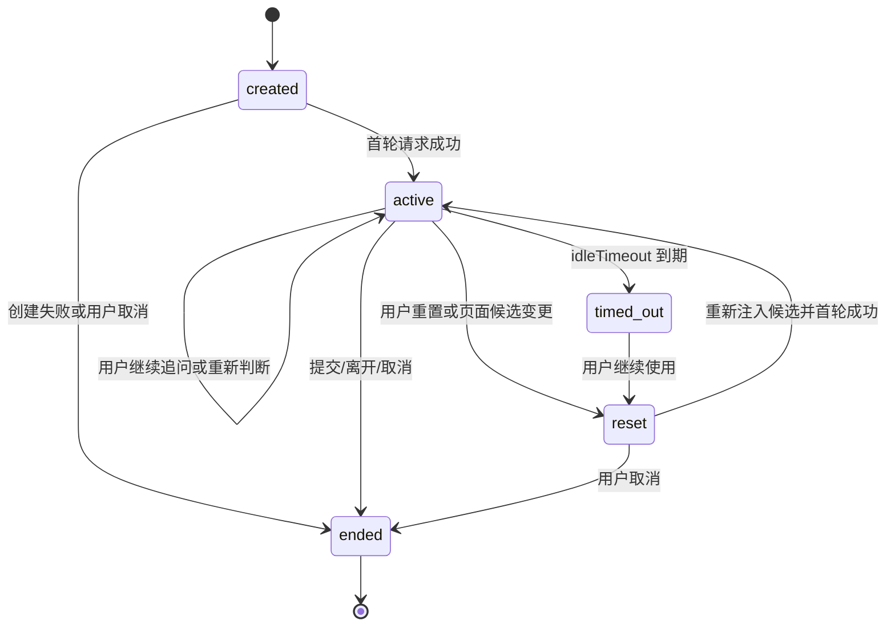
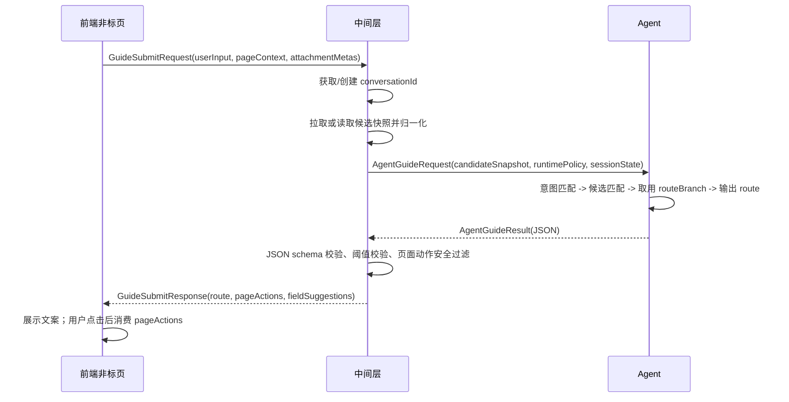

# 接口契约草案

> 模块：非标页内嵌智能引导  
> 切片：中间层接口契约草案  
> 日期：2026-07-28  
> 范围：定义前端、中间层、Agent 的请求/响应契约草案、决策流、会话生命周期和兜底规则。  
> 边界：不修改归一化契约，不修改 HTML 原型，不写中间层实现代码，不写评测用例，不做费用预估接口，不做视频 SOP 接口。

## 1. 契约定位

本契约位于前端页面与 Agent 能力之间。前端只提交用户输入、页面上下文和轻量附件元数据；中间层负责会话、候选快照、归一化候选清单、阈值策略和错误兜底；Agent 只在中间层提供的候选范围内做意图匹配与候选匹配，并把命中的 `routeBranch` 取用为最终 `route`。

核心约束：

1. `systemScopedVascList[]` 是 Agent 可匹配候选的唯一集合。
2. `vascType`、`serviceKind`、`serviceDomain`、`routeBranch` 必须来自中间层归一化结果。
3. Agent 禁止根据 `vascName`、`serviceName`、用户自然语言、历史对话或相似关键词自行改写 `routeBranch`。
4. Agent 输出的 `route` 必须等于被选中候选的 `routeBranch`，兜底时只能输出 `manual_fallback`。
5. 前端页面动作只消费 `pageActions`，不根据自然语言文案反推 DOM 操作。

## 2. 枚举与阈值

### 2.1 `matchState`

| 枚举值 | 含义 | 前端行为 | 是否允许字段写入 |
|--------|------|----------|------------------|
| `matched` | 明确命中一个候选，且置信度达到自动建议阈值 | 展示命中结果、字段建议和可用按钮 | 允许展示填入按钮，是否实际填入由用户触发 |
| `partial` | 有候选倾向，但信息不足或置信度低于自动建议阈值 | 展示补充追问、候选说明或人工确认提示 | 不允许自动字段填入；可复制文本或继续追问 |
| `none` | 无候选命中，或候选数据不可用/冲突 | 展示兜底提示或人工处理入口 | 不允许字段写入 |

### 2.2 `matchConfidence`

| 阈值区间 | 对应状态 | 规则 |
|----------|----------|------|
| `>= 0.80` | `matched` | 可输出 `fieldSuggestions` 和启用 `fill_field` 类 `pageActions` |
| `>= 0.60` 且 `< 0.80` | `partial` | 不启用字段填入，只允许追问、复制建议或人工确认 |
| `< 0.60` | `none` | 进入兜底，不输出可写入字段建议 |

正式规则：

1. `matchConfidence` 类型为 number，取值范围 `0` 到 `1`。
2. 中间层可在请求中下发 `runtimePolicy.matchThresholds`，默认使用本契约阈值。
3. Agent 不得自行降低阈值；如中间层未下发阈值，按默认阈值执行。
4. 2d 标准增值纠偏和 2a 命名直选可不输出 SOP 匹配置信度，但仍需输出 `matchState`；建议 `matched` / `partial` / `none` 均显式写入，避免前端处理 `null`。

## 3. 请求 Schema

### 3.1 前端 -> 中间层：`GuideSubmitRequest`

```json
{
  "requestId": "req_20260728_0001",
  "conversationId": "conv_EVENT_DEMO_001",
  "eventCode": "EVENT_DEMO_001",
  "pageContext": {
    "pageCode": "value_add_order_step2_nonstandard",
    "pageUrl": "/vas/create/step2",
    "locale": "zh-CN",
    "timezone": "Asia/Shanghai",
    "activeServiceCodes": ["OW01V1602"],
    "visibleFieldIds": [
      "vaAtoms_OW01V1602_attributes_BEOR_attributeValue",
      "vaAtoms_OW01V1602_attributes_VAS_ATTR_REL_RD_attributeValue"
    ]
  },
  "userInput": {
    "text": "请仓库按条码对应关系换标后上架",
    "inputSource": "ai_inline_panel",
    "submittedAt": "2026-07-28T18:10:00+08:00"
  },
  "popupContext": {
    "conversationId": "popup_conv_001",
    "customerInput": "这批货需要按条码对应关系换标后上架",
    "routeDecision": "nonstandard",
    "systemScopedVascList": [],
    "exceptionContext": {},
    "dialogHistory": []
  },
  "attachmentMetas": [
    {
      "attachmentId": "att_001",
      "fileName": "条码对应关系.xlsx",
      "fileExt": ".xlsx",
      "fileSizeBytes": 20480,
      "uploadFieldId": "vaAtoms_OW01V1602_vasFiles_VAS_ATTR_REL_TCRBCAL",
      "uploaded": true
    }
  ],
  "clientState": {
    "lastRoute": "2b_other_service_sop",
    "lastMatchState": "partial",
    "draftFieldValues": {
      "background": "",
      "description": ""
    }
  }
}
```

前端只传页面事实和用户输入，不传 `systemScopedVascList` 的权威归一化结果。候选归一化由中间层负责注入，避免前端缓存过期或被页面脚本污染。

### 3.2 中间层 -> Agent：`AgentGuideRequest`

```json
{
  "requestId": "req_20260728_0001",
  "conversationId": "conv_EVENT_DEMO_001",
  "turnId": "turn_0003",
  "eventCode": "EVENT_DEMO_001",
  "pageContext": {
    "pageCode": "value_add_order_step2_nonstandard",
    "activeServiceCodes": ["OW01V1602"],
    "visibleFieldIds": [
      "vaAtoms_OW01V1602_attributes_BEOR_attributeValue",
      "vaAtoms_OW01V1602_attributes_VAS_ATTR_REL_RD_attributeValue"
    ]
  },
  "userInput": {
    "text": "请仓库按条码对应关系换标后上架",
    "inputSource": "ai_inline_panel",
    "submittedAt": "2026-07-28T18:10:00+08:00"
  },
  "conversationHistory": [
    {
      "turnId": "turn_0001",
      "role": "user",
      "content": "这批货需要按条码对应关系换标后上架",
      "timestamp": "2026-07-28T18:08:00+08:00",
      "route": null,
      "matchState": null
    },
    {
      "turnId": "turn_0002",
      "role": "agent",
      "content": "请补充条码对应关系文件是否已准备好。",
      "timestamp": "2026-07-28T18:09:00+08:00",
      "route": "2b_other_service_sop",
      "matchState": "partial"
    }
  ],
  "candidateSnapshot": {
    "candidateListVersion": "candidate-normalization-v1",
    "normalizationGeneratedAt": "2026-07-28T18:00:00+08:00",
    "systemScopedVascList": []
  },
  "sopContext": {
    "injectionMode": "middleware_filtered",
    "filteredTemplates": [
      {
        "templateId": "sop_inbound_relabel_001",
        "title": "入库条码换标后上架",
        "matchScore": 0.92,
        "templateContent": "模板全文或摘要"
      }
    ],
    "totalTemplateCount": 128,
    "tokenBudgetExceeded": true
  },
  "runtimePolicy": {
    "matchThresholds": {
      "matchedMin": 0.8,
      "partialMin": 0.6
    },
    "allowFieldFillActions": true,
    "allowCandidateOutOfScope": false,
    "allowRouteRewrite": false,
    "defaultFallbackRoute": "manual_fallback",
    "returnDomainPolicy": "manual_fallback_reserved_extension"
  },
  "sessionState": {
    "status": "active",
    "createdAt": "2026-07-28T18:00:00+08:00",
    "lastActiveAt": "2026-07-28T18:09:40+08:00",
    "turnCount": 3
  },
  "popupContext": {
    "conversationId": "popup_conv_001",
    "customerInput": "这批货需要按条码对应关系换标后上架",
    "routeDecision": "nonstandard",
    "systemScopedVascList": [],
    "exceptionContext": {},
    "dialogHistory": []
  }
}
```

中间层必须把已归一化的 `candidateSnapshot.systemScopedVascList[]` 注入给 Agent。Agent 不直接调用 `listAllVasc`、`getVascInfo` 或 `getVasList`，也不自行补齐 `vascType` / `serviceKind`。
`conversationHistory` 由中间层拼接历史轮次；首轮可为空数组。`popupContext` 为可选字段，缺失时 Agent 正常执行 2d 标准增值纠偏；当 `popupContext.routeDecision === "nonstandard"` 时，Agent 跳过 2d，直接进入 2a / 2b。`sopContext.injectionMode = "prompt_embedded"` 表示 SOP 模板全文已嵌入 system prompt，本字段可为空；`sopContext.injectionMode = "middleware_filtered"` 表示中间层因 token 限制预过滤后注入 top-N 模板。

## 4. 响应 Schema

### 4.1 Agent -> 中间层：`AgentGuideResult`

```json
{
  "requestId": "req_20260728_0001",
  "conversationId": "conv_EVENT_DEMO_001",
  "turnId": "turn_0003",
  "route": "2b_other_service_sop",
  "matchState": "matched",
  "matchConfidence": 0.86,
  "matchedCandidateId": "VASC_NONSTD_INBOUND:OW01V1602",
  "selectedVasc": {
    "candidateId": "VASC_NONSTD_INBOUND:OW01V1602",
    "vascCode": "VASC_NONSTD_INBOUND",
    "vascName": "入库非标增值（特批）",
    "vascType": "nonstandard"
  },
  "selectedService": {
    "serviceCode": "OW01V1602",
    "serviceName": "入库其他服务需求",
    "serviceKind": "other_service_request",
    "serviceDomain": "inbound"
  },
  "fieldSuggestions": {
    "background": "到仓商品条码与系统登记信息不一致，需要仓库按客户提供的条码对应关系处理后上架。",
    "description": "请根据附件中的实物条码与新商品条码对应关系补贴标签，并上架到指定新入库单。客户确认不等于审核通过。"
  },
  "confirmationSummary": "客户确认按附件中的实物条码与新商品条码对应关系补贴标签，并上架到指定新入库单。客户确认不等于审核通过。",
  "missingFields": [],
  "attachmentRequirements": [
    {
      "name": "实物条码与新商品条码对应关系",
      "required": true,
      "acceptedFileExts": [".xls", ".xlsx", ".doc", ".docx", ".pdf"],
      "targetUploadFieldId": "vaAtoms_OW01V1602_vasFiles_VAS_ATTR_REL_TCRBCAL"
    }
  ],
  "attachmentCheck": {
    "state": "metadata_checked",
    "missingRequired": [],
    "warnings": []
  },
  "pageActions": [
    {
      "action": "fill_field",
      "target": "vaAtoms_OW01V1602_attributes_BEOR_attributeValue",
      "valueRef": "fieldSuggestions.background",
      "label": "填入需求背景说明",
      "enabled": true
    },
    {
      "action": "fill_field",
      "target": "vaAtoms_OW01V1602_attributes_VAS_ATTR_REL_RD_attributeValue",
      "valueRef": "fieldSuggestions.description",
      "label": "填入需求描述",
      "enabled": true
    },
    {
      "action": "copy_text",
      "target": "aiResult",
      "valueRef": "customerMessage",
      "label": "复制建议",
      "enabled": true
    }
  ],
  "displayText": "已匹配入库其他服务需求，可按建议补充字段和附件。",
  "customerMessage": "建议选择入库其他服务需求，并补充条码对应关系与标签文件。字段建议仅用于创建申请，不代表审核通过。",
  "decisionTrace": {
    "intentMatched": true,
    "candidateMatched": true,
    "routeSource": "selectedCandidate.routeBranch",
    "routeRewriteApplied": false
  }
}
```

### 4.2 中间层 -> 前端：`GuideSubmitResponse`

```json
{
  "requestId": "req_20260728_0001",
  "conversationId": "conv_EVENT_DEMO_001",
  "status": "ok",
  "route": "2b_other_service_sop",
  "matchState": "matched",
  "matchConfidence": 0.86,
  "selectedVasc": {
    "candidateId": "VASC_NONSTD_INBOUND:OW01V1602",
    "vascCode": "VASC_NONSTD_INBOUND",
    "vascName": "入库非标增值（特批）",
    "vascType": "nonstandard"
  },
  "selectedService": {
    "serviceCode": "OW01V1602",
    "serviceName": "入库其他服务需求",
    "serviceKind": "other_service_request",
    "serviceDomain": "inbound"
  },
  "fieldSuggestions": {
    "background": "到仓商品条码与系统登记信息不一致，需要仓库按客户提供的条码对应关系处理后上架。",
    "description": "请根据附件中的实物条码与新商品条码对应关系补贴标签，并上架到指定新入库单。客户确认不等于审核通过。"
  },
  "confirmationSummary": "客户确认按附件中的实物条码与新商品条码对应关系补贴标签，并上架到指定新入库单。客户确认不等于审核通过。",
  "missingFields": [],
  "attachmentRequirements": [],
  "attachmentCheck": {
    "state": "metadata_checked",
    "missingRequired": [],
    "warnings": []
  },
  "pageActions": [],
  "displayText": "已匹配入库其他服务需求，可按建议补充字段和附件。",
  "customerMessage": "建议选择入库其他服务需求，并补充条码对应关系与标签文件。字段建议仅用于创建申请，不代表审核通过。",
  "error": null,
  "session": {
    "status": "active",
    "expiresAt": "2026-07-28T18:40:00+08:00",
    "nextExpectedAction": "user_confirm_or_fill"
  }
}
```

中间层可对 Agent 输出做结构校验、裁剪和安全封装，但不得把候选外服务补进 `selectedVasc` / `selectedService`，也不得把低置信结果强行改成 `matched`。

## 5. Agent 决策流

Agent 必须按以下顺序执行：

1. 意图匹配：判断用户输入是否属于当前非标页内嵌智能引导范围。
2. 候选匹配：只在 `candidateSnapshot.systemScopedVascList[]` 内匹配候选。
3. 候选有效性检查：检查候选的 `normalizationStatus`、`vascType`、`serviceKind`、`serviceDomain`、`isCandidateSelectable`。
4. 取用 `routeBranch`：命中候选后，最终 `route = selectedCandidate.routeBranch`。
5. 输出结构化响应：按 `route` 输出字段建议、附件提示和页面动作。
6. 兜底：无法满足任一前置条件时，输出 `route = manual_fallback`。

决策伪代码：

```text
skipStandardRedirect = popupContext.routeDecision == "nonstandard"

if userInput is empty or out_of_scope:
  route = manual_fallback
  matchState = none
else:
  if skipStandardRedirect:
    skip 2d_standard_redirect check
  else:
    evaluate 2d_standard_redirect before nonstandard matching

  matchedCandidate = match within systemScopedVascList only
  if no matchedCandidate:
    route = manual_fallback
    matchState = none
  else if matchedCandidate.normalizationStatus is not routable:
    route = manual_fallback
    matchState = none
  else if matchedCandidate.serviceDomain == return:
    route = manual_fallback
    matchState = partial or none
  else:
    route = matchedCandidate.routeBranch
    matchState = confidence_to_state(matchConfidence)

  if route == 2b_other_service_sop and matchState == matched:
    confirmationSummary must include "客户确认不等于审核通过"
    missingFields = []
    pageActions may include fill_field actions
  else if route == 2b_other_service_sop and information is insufficient:
    confirmationSummary = null or ""
    missingFields = required follow-up fields
    pageActions must include ask_followup action and must not include fill_field action
  else:
    confirmationSummary = null or ""
    missingFields = []
```

禁止项：

1. 禁止 Agent 输出与 `selectedCandidate.routeBranch` 不一致的 `route`。
2. 禁止 Agent 把 `serviceDomain=return` 自行改成 `inbound`、`in_warehouse` 或 `outbound`。
3. 禁止 Agent 因用户表达强烈而推荐 `systemScopedVascList` 外的服务。
4. 禁止 Agent 在 `matchState=partial` 或 `none` 时启用 `fill_field` 页面动作。

## 6. 会话生命周期

### 6.1 状态枚举

| 状态 | 含义 | 允许操作 |
|------|------|----------|
| `created` | 中间层已创建会话，但尚未完成首轮 Agent 请求 | 接收首轮输入、注入候选快照 |
| `active` | 会话可继续交互 | 接收追问、确认、重新判断、字段建议 |
| `timed_out` | 超过空闲超时时间 | 禁止复用旧候选快照；需重置或新建 |
| `reset` | 用户或页面触发重置 | 清空历史轮次，重新拉取候选快照 |
| `ended` | 用户离开流程、提交、取消或中间层主动结束 | 禁止继续写入页面动作 |

### 6.2 状态转换规则



建议默认策略：

1. `idleTimeoutMinutes = 30`。
2. 页面刷新、候选清单版本变化、`eventCode` 变化时，旧会话必须进入 `reset`。
3. `timed_out` 后不得继续使用旧 `pageActions`。
4. `ended` 后所有页面写入动作失效，前端需重新创建会话。

## 7. 调用时序图



## 8. 错误兜底规则

| 场景 | 中间层处理 | 前端响应 | 允许页面动作 |
|------|------------|----------|--------------|
| Agent 返回非法 JSON | 丢弃本轮 Agent 输出，返回 `status=error`、`error.code=AGENT_INVALID_JSON` | 展示兜底文案，可提示重试 | 仅允许 `copy_text` 兜底文案，不允许 `fill_field` |
| Agent 超时 | 返回 `error.code=AGENT_TIMEOUT`，保留会话为 `active` 或按策略转 `timed_out` | 展示重试和人工处理入口 | 不允许字段写入 |
| Agent 拒答或无法回答 | 返回 `route=manual_fallback`、`matchState=none`、`error.code=AGENT_REFUSAL` | 展示人工确认或继续补充信息 | 不允许字段写入 |
| 候选清单缺失 | 返回 `error.code=CANDIDATE_SNAPSHOT_MISSING` | 提示稍后重试或人工处理 | 不允许字段写入 |
| 候选字段冲突 | 返回 `route=manual_fallback`、`matchState=none` | 提示候选信息需人工确认 | 不允许字段写入 |
| 低置信 | 返回 `matchState=partial` 或 `none` | 展示追问或复制建议 | 不允许 `fill_field` |

错误对象：

```json
{
  "code": "AGENT_TIMEOUT",
  "message": "智能判断暂时不可用，请稍后重试或联系人工处理。",
  "retryable": true,
  "fallbackRoute": "manual_fallback"
}
```

## 9. `serviceDomain=return` 兜底与扩展

当前模块核心分支只覆盖：

1. `inbound`
2. `in_warehouse`
3. `outbound`

`serviceDomain=return` 默认规则：

1. 不进入 `2b_other_service_sop`。
2. 不允许 Agent 把退货域改写为入库、库内或出库域。
3. 命中退货域候选时，输出 `route=manual_fallback`，`matchState=partial` 或 `none`。
4. `customerMessage` 应说明当前退货类非标需求需人工确认或等待后续扩展。
5. 中间层可在 `runtimePolicy.returnDomainPolicy` 中保留扩展入口，当前固定为 `manual_fallback_reserved_extension`。

预留扩展字段：

```json
{
  "extension": {
    "serviceDomain": "return",
    "reservedRoute": "2b_return_service_sop",
    "enabled": false,
    "reason": "当前切片不定义退货 SOP 分支"
  }
}
```

## 10. 本切片不做事项

| 不做事项 | 说明 |
|----------|------|
| 修改归一化契约 | 不新增或重写 `候选清单归一化契约.md` |
| 修改 HTML 原型 | 不改 `prototype_01_titlebar_inline.html` 或其他原型 |
| 中间层实现代码 | 不写 API、缓存、重试、鉴权、日志或部署代码 |
| 评测用例 | 不产出测试集、金标集、评测脚本 |
| 费用预估接口 | 只保留现有“以实际报价为准”边界，不定义接口 |
| 视频 SOP 接口 | 不定义视频上传、解析、转写或 SOP 生成接口 |
