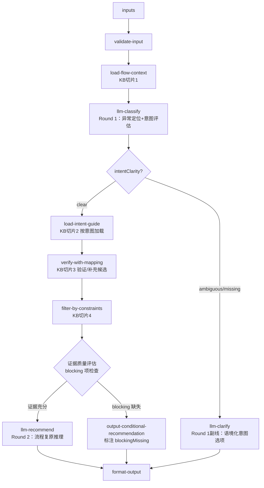

# value-add/value-add-product-recommendation 专家设计

> v2 说明：本目录是 `value-add-product-recommendation-v2`，用于对齐现网 recommendation 工作流后接入 `value-add-recommendation-rules` 决策层。旧正式目录 `value-add-product-recommendation/` 不在本步修改范围内。

## v2 对齐结论

现网导出的 recommendation 工作流显示，知识不是运行时读取 Git 文件，而是通过 Coze Text 节点预注入：

```text
prompts/kb-*.md -> coze.config.yml textNodes -> Coze Text output -> load-* / verify-* 节点 -> LLM
```

v2 沿用同一机制，并在旧专家 4 个 Text 节点基础上新增：

- `kb-decision-system-prompt`
- `kb-inference-rules`
- `kb-intent-routing-B0102E23`
- `kb-intent-routing-B03E03`
- `kb-forbidden-products`
- `kb-h-rules`

运行边界：

- 只能在 `enrichedContext.systemScopedVascList` 内推荐。
- `VASC202407031507376 入库商品拍照` 为产品级全局禁推。
- B0102E23 MVP 已接入：明确“拍照暂存 + 换纸箱原单上架”时，推断为先拍照/视频，再原单上架；不推荐“入库商品拍照”。
- B03E03 仅保留最小路由：描述明确则推断，模糊才追问。

VASC 产品推荐：作为**流程复原顾问**，基于入库正常流程语境、异常阻断阶段定位和客户恢复意图，输出候选 VASC 推荐、缺失确认项和服务配置手交。

---

## 调用说明

### 侧边栏固定触发话术

本专家在“处理异常 - 填写增值产品信息”侧边栏自动打开时，应由前端/编排层固定发送以下 query 模板。该模板不是临时测试话术，而是 MVP 主线入口话术，用于把异常单号带入推荐专家，并触发标准/非标分流：

```text
请根据异常单号{EventNo}的当前异常情况，帮我判断应该选择哪个增值服务；如果有多个标准增值都可以，请先问我想怎么处理，再推荐合适产品；如果需要走非标，请告诉我必须补充哪些信息，避免提交后被驳回
```

主线分流：

| 分流 | 依据 | 交付 |
|---|---|---|
| 标准增值 | xlsx（202511）+ 中间层 `listAllVasc` 注入的 `systemScopedVascList` 圈定 | 该推标准就推标准，避免无必要非标 |
| 非标增值 | 审核 SOP 知识库 + SOP 模板/填写示例 | 追问真实需求，生成给客户确认的 SOP 摘要 |

边界：

- 该话术只负责触发推荐专家，不代表 LLM 可以自行扩展候选产品。
- 推荐产品仍必须来自 `inputs.enrichedContext.systemScopedVascList`。
- 标准覆盖不了、客户诉求需要非标或系统候选只剩非标时，按非标路径追问 SOP 所需信息。
- 若客户意图不明确，先追问处理方向；若客户已明确处理意图，直接推断并推荐。

### 适用场景

- 用户问某个入库异常应该选择哪个增值产品。
- 用户已表达原单上架、新单上架、销毁、自提、拍照、调拨、非标等处理意图。
- 不适用：VASC 下服务项/原子配置（→ `value-add-service-config`）；已提交增值单状态（→ `value-add-order-status`）；入库差异责任核实（→ `inbound-exception-check`）。

### 最小入参

- `inputs.exceptionCode` 或 `inputs.handoffFacts.exceptionCode`。
- 若要给首选推荐，建议同时提供 `customerActionHint` 或 `customerActionNormalized`。

### 参数提示

- `handoffFacts` 来自 `value-add-exception-diagnosis` 时优先使用。
- `pscCode`（或 `pscSeries`）能显著影响数量差异类异常的推荐路径（标准头程 vs 自验 vs 海外验责任不同）。
- `objectLevel`、`exceptionNode` 能减少误推荐。
- 不从 OpenAPI 字段反推 VASC 适用性。

### 示例调用

```json
{
  "query": "推荐该异常可选的 VASC",
  "customerIntent": "客户希望包裹条码异常继续上架",
  "customerCode": "C10001",
  "customerName": "",
  "username": "agent01",
  "language": "zh_CN",
  "inputContext": { "chainId": "case-20260624-003" },
  "inputs": {
    "exceptionCode": "B01E1615",
    "customerActionHint": "继续上架",
    "objectLevel": "package",
    "pscSeries": "OW01011"
  }
}
```

```json
{
  "query": "基于诊断结果给出 VASC 候选",
  "customerIntent": "客户想重新下一单上架",
  "customerCode": "C10001",
  "customerName": "",
  "username": "agent01",
  "language": "zh_CN",
  "inputContext": { "chainId": "case-20260624-004", "sourceExpertId": "value-add-exception-diagnosis" },
  "inputs": {
    "handoffFacts": {
      "exceptionCode": "B01E1315",
      "exceptionName": "商品条码异常(需客户处理)",
      "objectLevel": "product",
      "customerActionHint": "新单上架",
      "pscSeries": "OW01022"
    }
  }
}
```

---

## 1. 输入设计

### 框架顶层（不写入 inputSchema）

| 字段 | 类型 | 说明 |
|---|---|---|
| `query` | string | 任务说明 |
| `customerIntent` | string | 业务问题摘要 |
| `inputContext` | object | `chainId`；可选 `sourceExpertId` |

### inputs 业务字段

| 字段 | 类型 | 必填 | 说明 |
|---|---|---|---|
| `exceptionCode` | string | 条件 | 异常编码。 |
| `exceptionName` | string | 否 | 异常名称。 |
| `customerActionHint` | string | 否 | 用户处理意图线索（自然语言）。 |
| `customerActionNormalized` | string | 否 | 已归一意图（原单上架/新单上架/销毁/自提/拍照/调拨/非标）。 |
| `objectLevel` | string | 否 | 异常对象层级：`order`/`package`/`product`/`item`/`pallet`。 |
| `exceptionNode` | string | 否 | 异常发生节点（入库/库内）。 |
| `pscCode` | string | 否 | 完整 PSC 编码，如 `OW01011004124`。 |
| `pscSeries` | string | 否 | PSC 系列前缀，如 `OW01011`/`OW01022`/`OW01032`；影响数量异常推荐路径。 |
| `inboundOrderNo` | string | 否 | 入库单号，只作上下文。 |
| `orderStatusHint` | string | 否 | 上游已知入库单状态（影响原单上架可行性）。 |
| `handoffFacts` | object | 条件 | 来自 `value-add-exception-diagnosis` 的结构化事实，优先级高于同名直接入参。 |
| `enrichedContext` | object | 否 | 编排器聚合事实；含上轮推荐状态时支持断点续传。 |

---

## 2. 知识架构（KB 切片 + LLM Prompt）

将知识按**推理用途**分为 4 个 KB 切片 + 3 个 LLM Prompt：

| 分类 | 文件 | 用途 | 消费节点 |
|---|---|---|---|
| 流程语境层 | `prompts/kb-flow-context.md` | 通用入库阶段 + 异常阻断阶段分类 + PSC 差异矩阵 | `llm-classify` Round 1 |
| 意图导航层 | `prompts/kb-intent-guide.md` | 6 个客户意图各自的 VASC 候选导航与业务语义 | `llm-recommend` Round 2 |
| 紧凑映射层 | `prompts/kb-mapping-table.md` | 异常编码 → VASC 候选编码的紧凑查询表 | `verify-with-mapping` |
| 约束过滤层 | `prompts/kb-vasc-constraints.md` | VASC 启用态、入库单状态依赖、对象层级限制 | `filter-by-constraints` |
| Round 1 Prompt | `prompts/classify.md` | `llm-classify` 异常定位任务框架：输出 `blockedStage`/`pscTrack`/`intentClarity` | `llm-classify` Round 1 |
| Round 1 副线 Prompt | `prompts/clarify.md` | `llm-clarify` 语境化意图选项生成框架 | `llm-clarify` Round 1 副线 |
| Round 2 Prompt | `prompts/main.md` | `llm-recommend` 证据驱动推荐：基于已过滤候选输出首选 VASC 与 handoff | `llm-recommend` Round 2 |

> `prompts/kb-product-recommendation.md` 已被上述切片文件取代，仅保留作废弃说明。

通过 `coze.config.yml` 的 `textNodes` 在各加载节点注入对应 KB 切片；LLM 节点只消费节点输出，不直接读取 `docs/value-add/` 全量材料。

---

## 3. 工作流（两轮 LLM 分类与推荐）



### 两轮 LLM 设计说明

| 轮次 | 节点 | 上下文输入 | 任务范围 | 特点 |
|---|---|---|---|---|
| **Round 1** | `llm-classify` | 异常事实 + `kb-flow-context.md` | 异常定位、PSC 轨道判断、意图清晰度评估 | 任务窄，上下文小，可用轻量模型 |
| **Round 1 副线** | `llm-clarify` | Round 1 输出 + 全部意图描述 | 生成针对本异常的语境化意图选项 | 面向客户，描述具体而非通用 |
| **Round 2** | `llm-recommend` | Round 1 输出 + 意图导航 + 过滤后候选 | 流程复原推理，给出首选 VASC 及依据 | 推理聚焦，输入已结构化 |

### 节点说明

| 节点 | 类型 | 说明 |
|---|---|---|
| `validate-input` | 代码 | 校验异常编码或 `handoffFacts` 至少一项存在；合并 `handoffFacts`/`enrichedContext`/直接入参，输出统一事实对象。 |
| `load-flow-context` | 代码/textNode | 从 `prompts/kb-flow-context.md` 加载通用入库阶段摘要 + PSC 差异矩阵。 |
| `llm-classify` | **LLM Round 1** | 消费流程语境和异常事实，输出 `{blockedStage, exceptionCategory, pscTrack, needsResponsibilityCheck, intentClarity, recommendedIntentHints}`。 |
| `llm-clarify` | **LLM Round 1 副线** | `intentClarity=ambiguous/missing` 时启动；基于 Round 1 的异常定位，生成面向客户的语境化意图选项，放入 `intentOptions`。 |
| `load-intent-guide` | 代码/textNode | 按 Round 1 输出的 `customerActionNormalized` 从 `prompts/kb-intent-guide.md` 加载对应意图导航切片。 |
| `verify-with-mapping` | 代码/textNode | 从 `prompts/kb-mapping-table.md` 验证候选 VASC 是否在映射关系中存在，补充遗漏项。 |
| `filter-by-constraints` | 代码/textNode | 从 `prompts/kb-vasc-constraints.md` 过滤 inactive VASC、状态不满足和层级不匹配的候选。 |
| `evidence-gate` | 代码 | 检查 `blockingMissing` 项：有→条件性推荐路径；无→Round 2 推理路径。 |
| `llm-recommend` | **LLM Round 2** | 以流程复原框架推理，消费 Round 1 异常定位 + 意图导航切片 + 过滤后候选列表，输出首选 VASC 及完整推理依据。 |
| `format-output` | 代码 | 按四字段规范组装输出，填充 `outputContext` 和 `enrichedContext`。 |

---

## 4. 输出设计

`format-output` 根级必须返回 `structured`、`analysis`、`outputContext`、`enrichedContext` 四字段。

### structured

| 字段 | 类型 | 说明 |
|---|---|---|
| `outputPath` | string | 本次输出路径：`committed`/`conditional`/`intent_clarification`/`no_candidates`/`escalated`。 |
| `customerActionNormalized` | string | 归一后的客户意图；意图缺失时为 `unknown`。 |
| `exceptionPosition` | object | 异常阻断阶段（`blockedStage`）和 PSC 轨道（`pscTrack`）。 |
| `recommendedVascCandidates` | array | 候选 VASC，含 `code`、`name`、`activeStatus`、`reason`、`confidence`（`high`/`medium`/`low`）。 |
| `primaryRecommendation` | object/null | 首选 VASC；证据充分时填充，否则为 `null`。 |
| `notRecommendedOptions` | array | 不推荐项及理由（含 inactive VASC 的历史线索说明）。 |
| `missingConfirmations` | object | 结构化缺失项，见下文。 |
| `intentOptions` | array/null | 仅 `outputPath=intent_clarification` 时填充；候选意图分组供客户选择。 |
| `handoffToServiceConfig` | object/null | 给 `value-add-service-config` 的手交对象；仅 `primaryRecommendation` 非空时填充。 |

#### missingConfirmations 结构

废弃 `string[]` 格式，改为编排器可直接消费的结构：

```json
{
  "blockingMissing": [
    {
      "dimension": "orderStatus",
      "reason": "原单上架依赖入库单可继续操作",
      "source": "ask_customer",
      "blocksPath": "primaryRecommendation"
    }
  ],
  "informationalMissing": [
    {
      "dimension": "exceptionNode",
      "reason": "有了更准，没有也可给条件性推荐",
      "source": "enrich_from_upstream"
    }
  ]
}
```

- `blockingMissing`：缺失此项则无法给出 `primaryRecommendation`；编排器应追问或调用对应 API。
- `informationalMissing`：有了更准，没有也可输出条件性推荐；编排器可选择性补充。
- `source` 取值：`ask_customer` / `call_api:inbound-order-status` / `enrich_from_upstream`。

#### handoffToServiceConfig 结构

```json
{
  "vascCode": "VASC202407031503503",
  "vascName": "原单上架（包裹条码异常）",
  "customerActionNormalized": "原单上架",
  "objectLevel": "package",
  "exceptionCode": "B01E1615",
  "limitations": ["入库单须为可操作状态"]
}
```

### analysis 约束

- 先说明识别到的异常阶段和客户意图，再给候选。
- 对 inactive 或证据不足的 VASC 只作为历史/待确认线索，不呈现为可下单推荐。
- 不承诺页面一定可下单，不编造字段要求。
- 数量差异类异常须先说明 PSC 轨道对责任归属的影响，再给出 VASC 推荐或核实建议。

### outputContext

| 字段 | 说明 |
|---|---|
| `expertId` | 固定为 `value-add-product-recommendation`。 |
| `resultSummary` | 200 字以内摘要，概括输出路径、客户意图归一、首选/候选 VASC 和缺失确认项。 |
| `chainId` | 透传 `inputContext.chainId`，缺失时为空字符串。 |

`outputContext` 是框架字段，不写入 `manifest.outputSchema`。

### enrichedContext

```json
{
  "valueAddVascRecommendation": {
    "exceptionCode": "B01E1315",
    "exceptionPosition": { "blockedStage": "putaway", "pscTrack": "self_inspection" },
    "customerActionNormalized": "新单上架",
    "primaryVascCode": "VASC202407161056217",
    "outputPath": "committed",
    "hasBlockingMissing": false
  }
}
```

`hasBlockingMissing` 供编排器判断是否需要继续追问，而不必解析完整 `missingConfirmations`。

---

## 5. 转人工 / 降级条件

- 异常编码无法识别且客户描述不足以归类异常类型。
- 映射关系中不存在任何候选 VASC，且客户坚持要求下增值。
- 所有候选 VASC 均为 inactive 且无可替代方案。
- 异常对象层级与客户意图明显冲突且无法调和（如包裹级异常要求商品级销毁但无确认证据）。
- 数量差异类异常在 OW01011 标准头程轨道：应优先由 `inbound-exception-check` 核实 Winit 责任，推荐专家不强行给出 VASC。

---

## 6. 待确认事项

- `pms.VascTomService_queryVascPage` v1 不作运行时调用，VASC 主数据依赖知识库同步；知识库过期可能导致推荐失效，需确认同步频率和降级说明。
- `kb-mapping-table.md` 当前为摘要口径（168 条关系，18 个 VASC），全量 normalized 数据待补齐至 `docs/value-add/source-references/exception-vas-data-package/data/normalized/`。
- 是否需要支持增量调用（第一轮输出 `intent_clarification`，第二轮带意图重新调用）：当前 `enrichedContext` 已包含 `outputPath` 和 `exceptionPosition`，但上轮中间状态的断点续传逻辑需与编排器（`experts_recaller`）对齐。
- `pscSeries` 字段来源：客户是否会主动提供，还是需要编排器从 `inbound-order-status` 的 `enrichedContext` 中补充？
