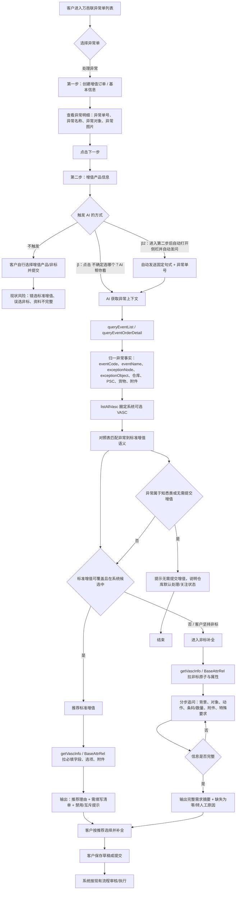
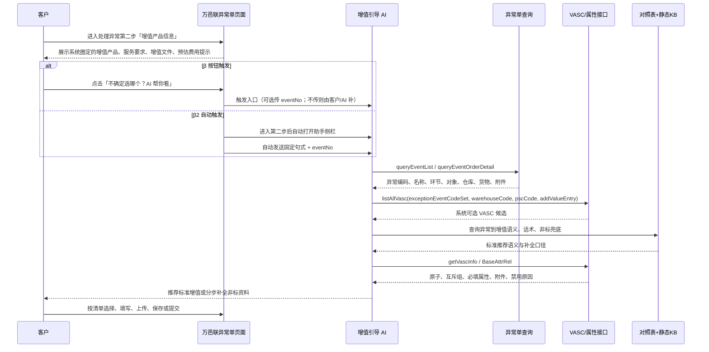
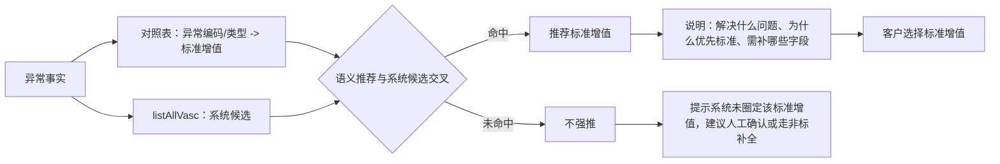
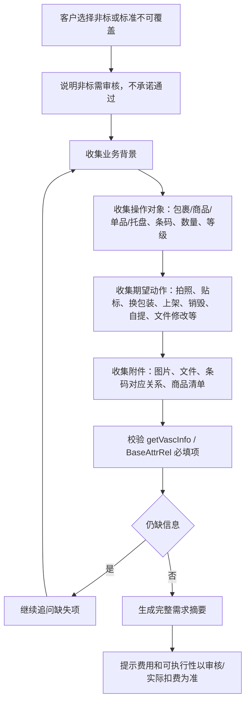
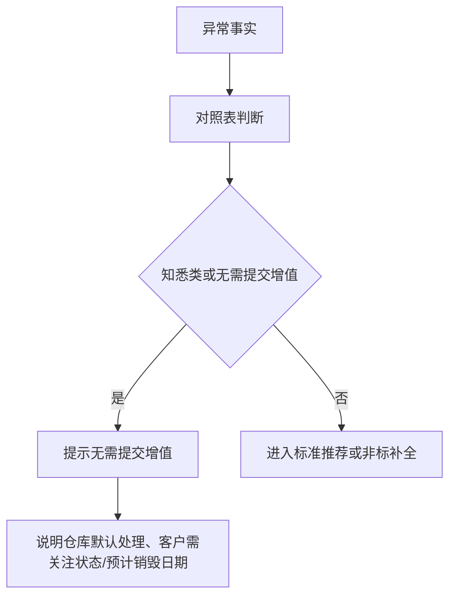

# D4 交互流程图

> 节点：N-M2-4  
> 主线：异常单入口 -> 处理异常 -> 第二步增值产品信息 -> AI 引导  
> 边界：本期覆盖异常单链路；入库/库内/出库/退货为异常环节分类，不覆盖普通直接下单入口

## 1. 总流程

## 2. β 首选路径交互

## 3. 标准增值推荐分支

推荐话术：

> 已根据异常编码、异常对象和系统当前可选增值范围，识别到可以优先选择「{标准增值}」。该路径比非标更标准，通常处理更快，也能减少因信息不完整被退回的概率。你还需要补充：{字段清单}。

## 4. 非标补全分支

非标话术：

> 当前需求超出标准增值覆盖范围，建议走非标增值。为减少驳回，请先补充：处理对象、期望动作、条码/商品清单、附件或图片、特殊要求。费用与是否可执行以审核和实际扣费为准。

## 5. 知悉类 / 无需提交增值分支

适用示例：

- 退货知悉类异常：只需告知处理方式，不引导提交增值。
- 包裹包装异常且无需客户处理：不建议新增增值单。

## 6. 边界标注

| 项 | 本期处理 | 不做 |
|----|----------|------|
| 异常单入口 | 覆盖，从异常单列表到处理异常第二步 | 不覆盖普通服务中心增值申请 |
| 入库/库内/出库/退货 | 作为异常环节分类参与推荐语义 | 不视为四条普通下单入口 |
| 页面触发 | β：第二步轻量入口；β2：进入第二步自动打开助手并自动发问；α：手动异常单号兜底 | 不做 γ 全页面自动感知 |
| 推荐 | 标准优先，非标补全，知悉类提示无需提交 | 不自动提交，不替客户审核 |
| 费用 | 保留“系统预估，最终按实际扣费” | 不做精确报价或价差承诺 |
| 验收 | 节点自检覆盖链路和边界 | 不做 N-M2-5 命中率/错选率 ground truth |

## 7. 落地检查清单

- [x] 主流程覆盖异常单列表、第一步异常明细、第二步增值产品信息。
- [x] 覆盖标准推荐、非标补全、知悉类无需提交三类分支。
- [x] 接口链路包含 `queryEventList/queryEventOrderDetail/listAllVasc/getVascInfo/BaseAttrRel`。
- [x] 明确 β 为一期首选，α 兜底，γ/δ 二期。
- [x] 补充 β2 自动打开助手侧栏并自动发送固定句式 + 单号的触发变体。
- [x] 标注入库/库内/出库/退货为异常环节，不扩大到普通直接下单。
- [x] 未做 N-M2-5 ground truth 验收设计。
